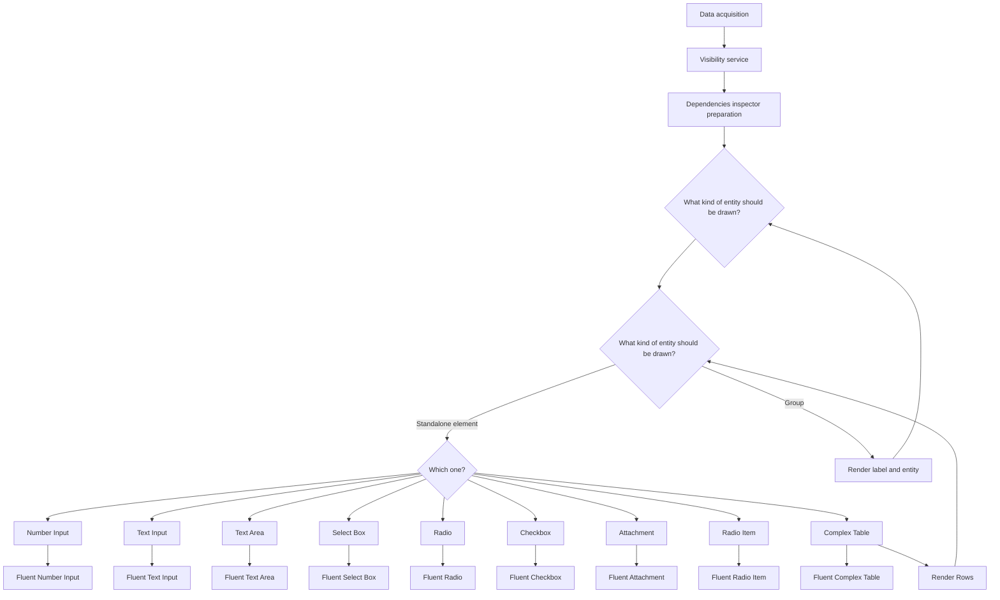

<div align="center">
  <h3 align="center">bpp-react-components</h3>
</div>

<details>
  <summary>Table of Contents</summary>
  <ol>
    <li>
      <a href="#about-the-project">About The Project</a>
      <ul>
        <li><a href="#built-with">Built With</a></li>
      </ul>
    </li>
    <li>
      <a href="#getting-started">Getting Started</a>
      <ul>
        <li><a href="#prerequisites">Prerequisites</a></li>
        <li><a href="#installation">Installation</a></li>
      </ul>
    </li>
    <li><a href="#usage">Usage</a></li>
    <li><a href="#roadmap">Roadmap</a></li>
    <li><a href="#contributing">Contributing</a></li>
    <li><a href="#license">License</a></li>
    <li><a href="#contact">Contact</a></li>
    <li><a href="#acknowledgments">Acknowledgments</a></li>
  </ol>
</details>


## About The Project

This project is needed to create a component that will receive profile data as input, as well as elements of various design systems. The output will be a profile editing component. 
This project will also serve as a storage place for other components of the "Profile Editor" project, so that in the future it will be possible to share these components between other teams.

<p align="right">(<a href="#readme-top">back to top</a>)</p>


### Built With

* [![React][React.js]][React-url]
* [![FluentUI][FluentUI.img]][FluentUI.url]
* [![Formik][Formik.img]][Formik.url]
* [![TypeScript][TypeScript.img]][TypeScript.url]
* [![Lodash][Lodash.img]][Lodash.url]
* [![Styled-components][Styled-components.img]][Styled-components.url]
* [![I18next][I18next.img]][I18next.url]
* [![Nanoid][Nanoid.img]][Nanoid.url]
* [![Redux][Redux.img]][Redux.url]

<p align="right">(<a href="#readme-top">back to top</a>)</p>

### Installation

1. Clone the repo
   ```sh
   git clone https://github.com/bpp-react-components.git
   ```
3. Install NPM packages
   ```sh
   npm install
   ```

<p align="right">(<a href="#readme-top">back to top</a>)</p>

## Usage

* npm
  ```sh
  npm install bpp-react-components
  ```
* usage
  ```sh
  more code will be presented later
  ```
  

<p align="right">(<a href="#readme-top">back to top</a>)</p>

### Old solution




<p align="right">(<a href="#readme-top">back to top</a>)</p>

<!-- MARKDOWN LINKS & IMAGES -->
[React.js]: https://img.shields.io/badge/React-20232A?style=for-the-badge&logo=react&logoColor=61DAFB
[React-url]: https://reactjs.org/
[FluentUI.img]: https://img.shields.io/badge/Fluent%20UI-0078D4?style=for-the-badge&logo=microsoft&logoColor=white
[FluentUI.url]: https://developer.microsoft.com/en-us/fluentui
[Formik.img]: https://img.shields.io/badge/Formik-EF6B52?style=for-the-badge&logo=formik&logoColor=white
[Formik.url]: https://formik.org/
[TypeScript.img]: https://img.shields.io/badge/TypeScript-3178C6?style=for-the-badge&logo=typescript&logoColor=white
[TypeScript.url]: https://www.typescriptlang.org/
[Lodash.img]: https://img.shields.io/badge/Lodash-3492FF?style=for-the-badge&logo=lodash&logoColor=white
[Lodash.url]: https://lodash.com/
[Styled-components.img]: https://img.shields.io/badge/styled--components-DB7093?style=for-the-badge&logo=styled-components&logoColor=white
[Styled-components.url]: https://styled-components.com/
[I18next.img]: https://img.shields.io/badge/i18next-26A69A?style=for-the-badge&logo=i18next&logoColor=white
[I18next.url]: https://www.i18next.com/
[Nanoid.img]: https://img.shields.io/badge/nanoid-000000?style=for-the-badge&logo=nano&logoColor=white
[Nanoid.url]: https://github.com/ai/nanoid
[Redux.img]: https://img.shields.io/badge/Redux-764ABC?style=for-the-badge&logo=redux&logoColor=white
[Redux.url]: https://redux.js.org/
