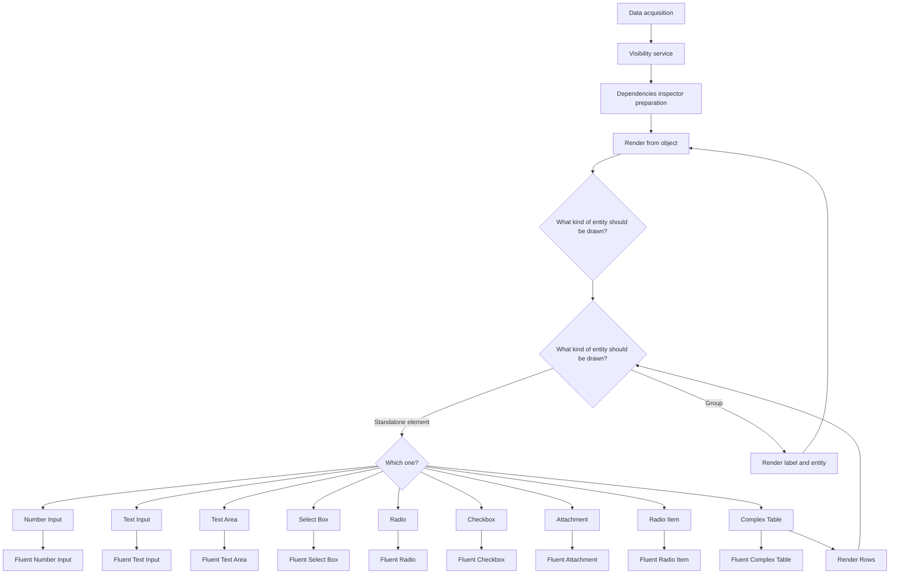
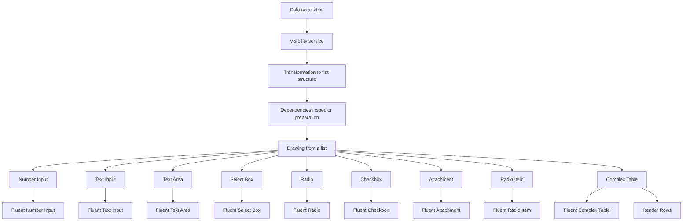
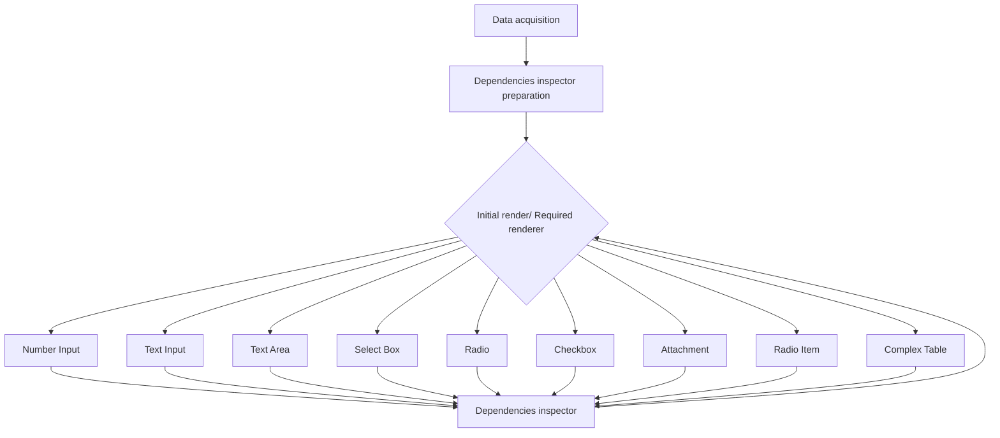
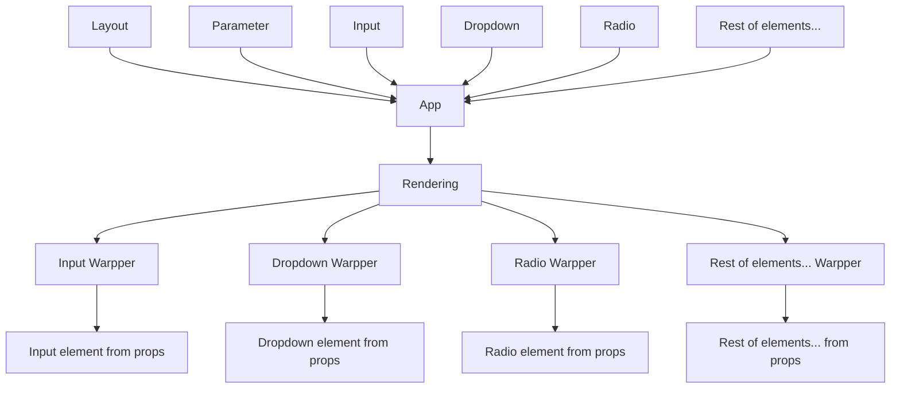

<div align="center">
  <h3 align="center">bpp-react-components</h3>
</div>

<details>
  <summary>Table of Contents</summary>
  <ol>
    <li><a href="#about-the-project">About The Project</a></li>
    <li><a href="#about-the-project">Built With</a></li>
    <li><a href="#about-the-project">Installation</a></li>
    <li><a href="#about-the-project">Usage</a></li>
    <li>
      <a href="#about-the-project">Old solution (Tree-Like Structure)</a>
      <ul>
        <li><a href="#prerequisites">Advantages</a></li>
        <li><a href="#installation">Disadvantages</a></li>
        <li><a href="#installation">Visual representation of architecture</a></li>
      </ul>
    </li>
    <li>
      <a href="#about-the-project">New solution (Flat Structure)</a>
      <ul>
        <li><a href="#prerequisites">Advantages</a></li>
        <li><a href="#installation">Disadvantages</a></li>
        <li><a href="#installation">Visual representation of architecture</a></li>
      </ul>
    </li>
    <li><a href="#about-the-project">Usage</a></li>
    <li><a href="#about-the-project">Usage</a></li>
    <li><a href="#about-the-project">Usage</a></li>
    <li><a href="#about-the-project">Usage</a></li>
    <li><a href="#about-the-project">Usage</a></li>
    <li>
      <a href="#getting-started">Getting Started</a>
      <ul>
        <li><a href="#prerequisites">Prerequisites</a></li>
        <li><a href="#installation">Installation</a></li>
      </ul>
    </li>
    <li><a href="#usage">Usage</a></li>
    <li><a href="#roadmap">Roadmap</a></li>
    <li><a href="#contributing">Contributing</a></li>
    <li><a href="#license">License</a></li>
    <li><a href="#contact">Contact</a></li>
    <li><a href="#acknowledgments">Acknowledgments</a></li>
  </ol>
</details>

## About the project

This project is needed to create a component that will receive profile data as input, as well as elements of various design systems. The output will be a profile editing component. 
This project will also serve as a storage place for other components of the "Profile Editor" project, so that in the future it will be possible to share these components between other teams.

### Built With

  * [![React][React.img]][React.url] – Library for building user interfaces.
  * [![Formik][Formik.img]][Formik.url] – Form state management in React.
  * [![TypeScript][TypeScript.img]][TypeScript.url] – Typed superset of JavaScript.
  * [![Lodash][Lodash.img]][Lodash.url] – Utility library for data manipulation.
  * [![Styled-components][Styled-components.img]][Styled-components.url] – CSS-in-JS styling for components.
  * [![I18next][I18next.img]][I18next.url] – Internationalization framework.
  * [![Nanoid][Nanoid.img]][Nanoid.url] – Tiny unique ID generator.
  * [![Redux][Redux.img]][Redux.url] – State management for JS apps.

### Installation

1. Clone the repo
   ```sh
   git clone https://github.com/bpp-react-components.git
   ```
3. Install NPM packages
   ```sh
   npm install
   ```

### Usage

* npm
  ```sh
  npm install bpp-react-components
  ```
* usage
  ```sh
  more code will be presented later
  ```
  
### Old data approach (Tree-Like Structure)

The previous approach was developed on the direct use of data coming from the BE. This approach is not perfect, because in it the drawing of all components is done in a tree-like way, or recursive rendering.

## Advantages:
  * Naturally reflects structure: good for tree-like or hierarchical data.
  * Easier to maintain nesting logic: each level is responsible for itself.

## Disadvantages:
  * Harder to control the rendering order at different levels.
  * Can be slower with very large structures: especially with deep nesting.
  * Difficult to cache and optimize: especially if many useEffect/useMemo are used.

## Visual representation of architecture



### New data approach (Flat Structure)

The new approach is to transform the input information into a form convenient for the frontend - in our case it is a flat list. Also, one of the principles of this approach is the transformation of input data.

## Advantages:

  * Better control over rendering: especially for virtualization.
  * Easier to optimize: easy to remember parts of a tree or lists.
  * Suitable for visualizing large objects

## Disadvantages:
  * Complication of logic when rendering hierarchy: need to restore nesting manually or via parentId relationship.
  * Additional parsing/preprocessing occurs.

## Visual representation of architecture



### Current dependency inspector logic
This mechanism is used to track changes within the project itself. Its main feature is to remember user changes and send signals to elements that need to change their state or be redrawn as a whole.
This mechanism compares current changes and a dependency table that must be generated before the application starts working



### Shared component solution (Editor Part)
The main idea of ​​this solution is to send additional information about all elements of the design system used by a particular team.
All interactive elements will be replaced by wrappers that will take information about visual elements from the top layer.

## Pros
  * All validation logic, error handling, etc. are in one place.
  * Simplifies support and testing.
  * Any design system can be used (Fluent UI, Material UI, Chakra, etc.).
  * Suitable for large teams or libraries where the design may change.
  * Design components are not aware of validation, which reduces coherence.
  * You can update the design or logic independently.
  * The user can pass any of their custom components (for example, input with autocomplete).

## Cons
  * If the component accepts any UI component, you need to correctly describe props.children or as-props.
  * In TypeScript, this may require complex generic types.
  * Fluent UI, MUI, Chakra may have different approaches to onChange, value, error, helperText, ref, etc.
  * Need to write "adapters" or map props for unification.

## Visual representation of architecture


### Additional info
  * Work organization strategy
  * PR rules
  * Cnahgelog rules:
    * Sections for change types: Added, Changed, Removed, Fixed
    * Semantic versioning: major (breaks API), minor (new feature, compatible), patch (bug fixes)
    * Recent changes from above
    * Keeping track of all changes in CHANGELOG.md
    * Examples:
```
[1.2.0] - 2025-06-23
### Added
- Export to CSV functionality.
- Support for Ukrainian language.

### Changed
- Redesigned settings page layout.

### Fixed
- Crash when saving without internet connection.

## [1.1.1] - 2025-06-10
### Fixed
- Incorrect validation on email field.
```


<!-- MARKDOWN LINKS & IMAGES -->
[React.img]: https://img.shields.io/badge/React-20232A?style=for-the-badge&logo=react&logoColor=61DAFB
[React.url]: https://reactjs.org/
[Formik.img]: https://img.shields.io/badge/Formik-EF6B52?style=for-the-badge&logo=formik&logoColor=white
[Formik.url]: https://formik.org/
[TypeScript.img]: https://img.shields.io/badge/TypeScript-3178C6?style=for-the-badge&logo=typescript&logoColor=white
[TypeScript.url]: https://www.typescriptlang.org/
[Lodash.img]: https://img.shields.io/badge/Lodash-3492FF?style=for-the-badge&logo=lodash&logoColor=white
[Lodash.url]: https://lodash.com/
[Styled-components.img]: https://img.shields.io/badge/styled--components-DB7093?style=for-the-badge&logo=styled-components&logoColor=white
[Styled-components.url]: https://styled-components.com/
[I18next.img]: https://img.shields.io/badge/i18next-26A69A?style=for-the-badge&logo=i18next&logoColor=white
[I18next.url]: https://www.i18next.com/
[Nanoid.img]: https://img.shields.io/badge/nanoid-000000?style=for-the-badge&logo=nano&logoColor=white
[Nanoid.url]: https://github.com/ai/nanoid
[Redux.img]: https://img.shields.io/badge/Redux-764ABC?style=for-the-badge&logo=redux&logoColor=white
[Redux.url]: https://redux.js.org/
