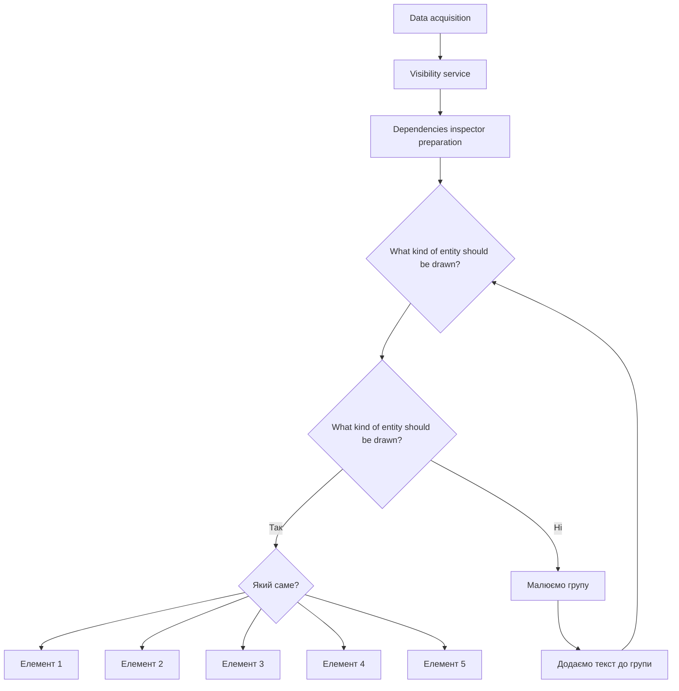

```mermaid
flowchart TD
    %% Коментар як візуальний блок:
    A[Data acquisition] --> B[Visibility service]
    B --> B1[Dependencies inspector preparation]
    B1 --> C{What kind of entity should be drawn?}

    C --> D1{What kind of entity should be drawn?}
    D1 -->|Так| E{Який саме?}
    E --> F1[Елемент 1]
    E --> F2[Елемент 2]
    E --> F3[Елемент 3]
    E --> F4[Елемент 4]
    E --> F5[Елемент 5]
    
    D1 -->|Ні| G[Малюємо групу]
    G --> H[Додаємо текст до групи]
    H --> C
```
